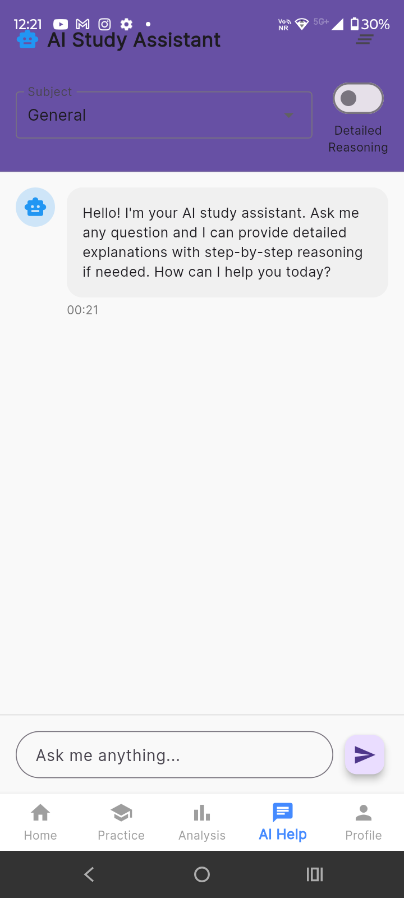
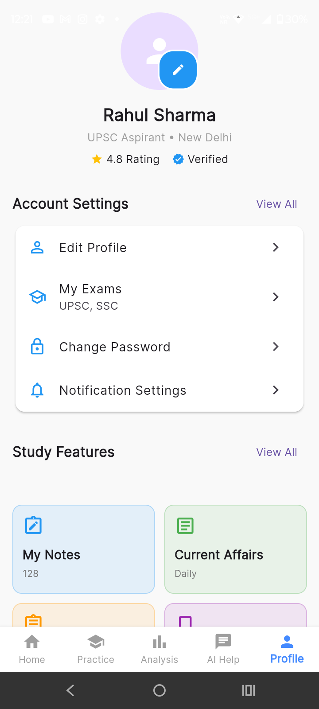

# 📚 AI For Exam – Your Smart Exam Preparation Partner



**AI For Exam** is an AI-powered mobile app designed for government exam aspirants like UPSC, SSC, Banking, and State exams. Built with Flutter, it provides a seamless experience with animated UI, AI chat support, progress tracking, and daily practice tools — everything needed for modern competitive exam preparation.

---

## 🎯 Purpose

> This project is built to showcase my full-stack mobile development skills and help me get a **Flutter Developer job**. It demonstrates clean architecture, animation handling, custom widgets, routing, and practical features built for real users.

---

## 📸 App Screenshots

| Home | Practice | Analysis |
|------|----------|----------|
|  |  |  |

| AI Chat | Profile | Premium |
|--------|---------|---------|
|  |  | 
---

## 🚀 Features

- 🔍 **Smart Practice**: Subject-wise mock tests with progress tracking
- 📊 **Live Analytics**: Real-time performance insights and accuracy
- 🤖 **AI Chat Assistant**: For doubts and motivation
- ⏰ **Countdown Timers**: Track upcoming exams
- 🌈 **Gradient UI & Animations**: Professional design and transitions
- 🔔 **Notification Badge**: Custom alerts inside app bar
- 📆 **Streaks & Goals**: Build consistency

---

## 🛠️ Tech Stack

| Layer       | Technology        |
|-------------|-------------------|
| Framework   | Flutter (Dart)    |
| State Mgmt  | Provider          |
| Navigation  | Named Routes      |
| UI Design   | Material + Custom |
| Animations  | AnimationController, Tween |
| Optional Backend | Firebase (planned) |

---

## 🧱 Project Structure


---

## 🧑‍💻 How to Run

```bash
# Clone the project
git clone https://github.com/yourusername/aiforexam.git

# Go into the project folder
cd aiforexam

# Install dependencies
flutter pub get

# Run the app
flutter run
📌 To-Do / Upcoming Features
🔐 Authentication (Sign up / Login)

🧠 GPT-powered Chat Integration

📚 Offline Question Bank

☁️ Firebase backend

🌍 Multi-language support

👨‍💼 About Me
Hi, I’m Prem Kumar – a passionate Flutter developer with a background in Electronics & Communication Engineering. I love building practical apps that solve real problems.

✅ This app is 100% developed by me

💼 Looking for full-time/internship as Flutter Developer

📫 Reach me at: prem.email@example.com

🔗 LinkedIn | GitHub

